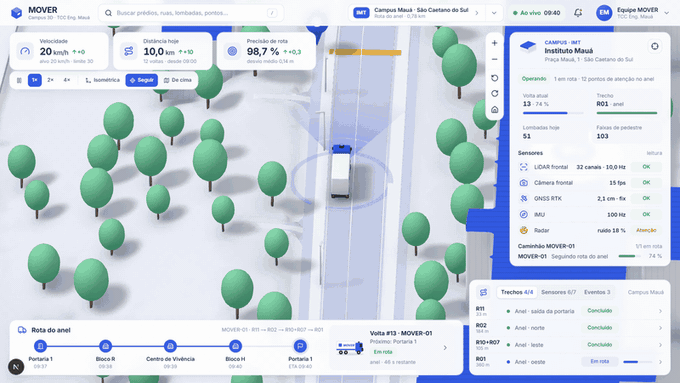

# MOVER · Campus Mauá 3D (site publicado)

Maquete 3D isométrica e interativa do campus do Instituto Mauá com o caminhão autônomo **MOVER**
dando voltas pelo anel viário. Ilustração do TCC de Engenharia (Instituto Mauá de Tecnologia).

**Abrir:** https://lucaskenz.github.io/mover-campus-3d-site/

**Modo apresentação (TV, feira):** https://lucaskenz.github.io/mover-campus-3d-site/?apresentacao=1

Este repositório contém só o site estático compilado, publicado pelo GitHub Pages. O código-fonte
fica num repositório privado.

- Arrastar move, a roda do mouse dá zoom, o botão direito gira. A tecla `/` abre a busca.
- Clique no caminhão, num prédio, numa lombada ou num pin para ver os detalhes.
- `?hora=14:00` fixa o relógio; os números da tela zeram a cada dia.
